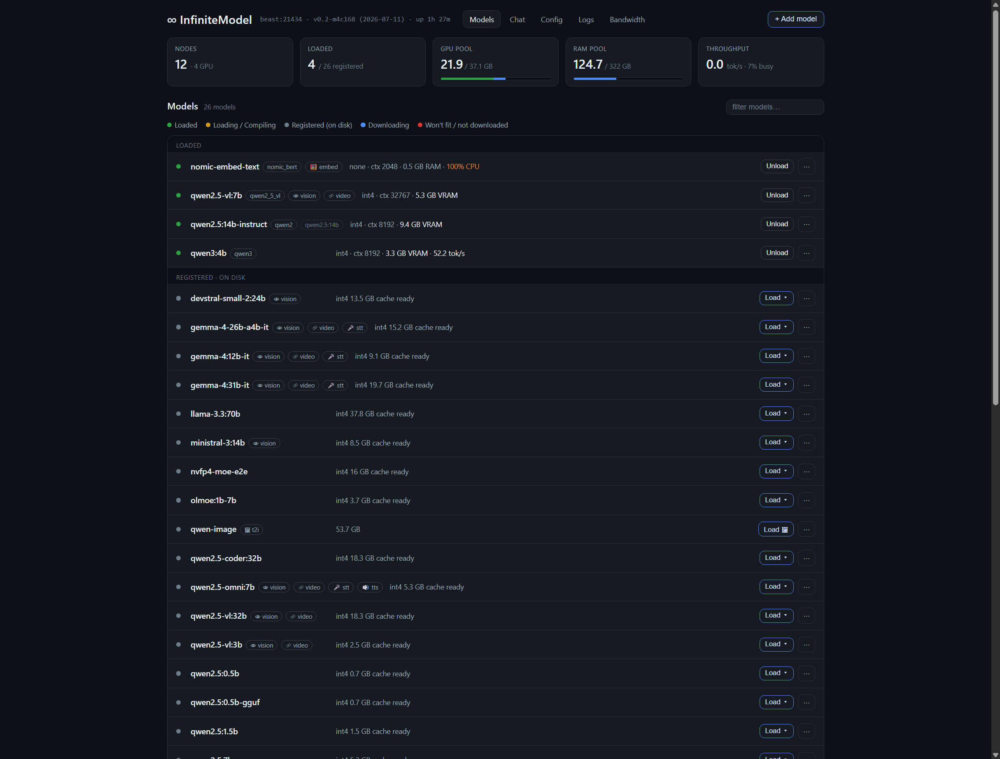

# ∞ InfiniteModel

**Run a large language model that's too big for any single machine — by splitting it across the
computers you already have.**

InfiniteModel is a from-scratch **distributed LLM inference engine**. One **controller** machine
pools the memory and compute of a fleet of **worker** machines (any mix of GPU and CPU boxes,
Windows or Linux) and splits a single transformer model's layers across them over a hand-rolled
plain-TCP transport. It's built on Hugging Face `transformers` + plain PyTorch — no vLLM, TGI, Ray,
or `torch.distributed` — so the **same code runs on Windows and Linux**.

It speaks **Ollama-, OpenAI-, and Anthropic-compatible** HTTP APIs, so tools you already use
(Ollama clients, OpenAI SDKs, Claude Code) can point at the cluster unchanged, plus a live web
dashboard.



> Personal research project — expect rough edges. Hugging Face **safetensors** is the native
> format; a model that ships only as a single-file **GGUF** is converted to safetensors
> automatically at add time (split multi-part GGUFs aren't supported) — see
> **[docs/GGUF.md](docs/GGUF.md)**.

> **A note from the author:** I'm fairly new to actually *using* git, so please go easy on me if the
> history or workflow isn't textbook — I'm still learning the etiquette. I built this for my own
> homelab and figured there might be demand for something like it out there, so I'm putting it up in
> case it's useful to someone else. Issues, suggestions, and patient corrections are all welcome.

---

## What it does

- **Fits big models by pooling machines.** Pipeline (layer-split) parallelism over plain TCP: each
  worker holds a contiguous block of layers; add machines to fit bigger models.
- **Goes faster where it can.** Tensor parallelism within a stage (capacity-proportional, GPU+CPU
  mixed meshes) and opt-in speculative decoding.
- **Quantization.** int4 (group-wise, fused tinygemm GEMM), int8 (per-channel), and **int2**
  (group-wise ~2.5-bit, group 64 — a *capacity* tier for **big dense** models that won't fit at
  int4; MoE experts auto-downgrade to int4. int2 is **GPTQ-calibrated at compile time** and
  explicit-compile only: a load without its calibrated cache **fails loud** instead of serving
  a degraded model. At ≤7B, int4 is strictly better) at load time;
  serves fp8 and nvfp4 checkpoints by dequantizing on the fly. Decode-kernel acceleration is
  **platform-tiered** — torch tinygemm int4 on NVIDIA/CPU, a Triton w4a16 + split-K kernel on **AMD
  GPUs (ROCm/RDNA)**, a Triton **w2a16** kernel for int2 on both GPU stacks, and an **opt-in fused
  MoE-expert kernel on Linux+NVIDIA**
  ([docs/ACCELERATION.md](docs/ACCELERATION.md)). Runs on AMD **1:1 with CUDA via HIP**
  ([docs/ROCM.md](docs/ROCM.md)).
- **Pre-compiled shard cache.** The controller quantizes a model once to `_shards/<quant>/`, so later
  loads stream small **pre-packed** int4/int2/int8 layers instead of bf16 + re-quantizing — for dense
  models *and* MoE (int4: fused-3D and per-expert Mixtral/OLMoE), bit-identical to a cold load.
  int2 is **GPTQ-calibrated** at compile (Hessian-guided error compensation over a bundled offline
  corpus — plain RTN collapses at 2 bits) and refuses to serve without its calibrated cache. Any model
  without an int4 cache shows a one-click **`⚡ int4` compile badge** on the models page (hover for
  the estimated on-disk size and free-disk check); compiles run in a background subprocess with live
  progress on the model's row.
- **GGUF ingestion.** A model published only as a llama.cpp **`.gguf`** is normalized to a standard
  safetensors checkpoint once at add time, then runs as an ordinary model (int4/int8 shard-cached,
  distributed) — no GGUF awareness downstream. Unlocks the large pool of GGUF-only community
  weights. Single-file quants; add via `/add_model?...&gguf_file=<one>.gguf` or the dashboard's GGUF
  field. Full details → **[docs/GGUF.md](docs/GGUF.md)**.
- **MoE & multimodal.** Mixture-of-Experts (incl. attention-on-GPU / experts-in-CPU-RAM offload), and
  distributed vision + audio (Qwen2.5-Omni, Qwen2.5-VL, Qwen3.6, Mistral3/Pixtral, Gemma 4 — both
  its encoder-free and ViT-tower variants): image/audio → text, plus **embeddings** via
  `/api/embed` / `/v1/embeddings`. **Speech out** (TTS) is served by a dedicated engine — see below.
- **Text-to-image.** Diffusers-layout checkpoints (Qwen-Image) download like any other model and
  serve `POST /v1/images/generations` on a controller-co-located GPU worker, with live per-step
  progress and a dashboard Generate panel. Two serve modes: **GPU-resident** — DiT in mixed-edge
  int4 (first/last blocks bf16 ≈ bf16 quality), text encoder on CPU, tiled VAE — or **offload**
  (`t2i_offload=1`, or the Load 🖼 dialog): the bf16 pipeline rests in system RAM and blocks
  stream to the GPU per step, so a 16 GB card renders at reference quality on ~4 GB of VRAM and
  **never evicts** resident LLMs. Full guide → [docs/T2I.md](docs/T2I.md).
- **Text-to-speech.** A dedicated **Kokoro-82M** engine (~0.3 GB, 54 voices) serves
  `POST /v1/audio/speech` (OpenAI Speech shape, `voice` name-mapped to Kokoro speakers) on a
  controller-co-located worker — clean 24 kHz WAV, ~4× realtime on a GPU with a transparent
  **CPU fallback** where the GPU can't JIT Kokoro's kernels (e.g. gfx1151). Downloads via
  **+ Add model** (`hexgrad/Kokoro-82M`) like any other model. It replaces the Qwen2.5-Omni Talker
  as the recommended speech path — the Omni Talker output is intrinsically choppy on that checkpoint
  (the Omni route still answers `/v1/audio/speech` for callers that request an Omni model by name).
  Full guide → [docs/TTS.md](docs/TTS.md).
- **Text-to-music** *(optional component).* **ACE-Step v1 3.5B** serves `POST /v1/audio/music`
  (genre/style prompt → instrumental or vocal WAV) — GPU-resident bf16 (~10 GB) or the same RAM
  **offload** recipe as t2i. Needs the heavy `acestep` package installed on a serving worker, so it
  is opt-in per box (a fleet without it just has no music model). As of **#media-anywhere** it is no
  longer locked to the controller's own box: placement runs it on the co-located GPU **or any remote
  GPU whose worker advertises the acestep runtime** (`can_t2a`), fetching the checkpoint via
  `snapshot_download` and returning the WAV over the control link — no shared filesystem required.
  Install recipe + API → [docs/T2A.md](docs/T2A.md).
- **Tool calling.** Native `tools` on all three chat APIs — Ollama `/api/chat` (`tool_calls` with
  object args), OpenAI `/v1/chat/completions` (`tool_calls` + `finish_reason:"tool_calls"`), and
  Anthropic `/v1/messages` (`tool_use` blocks) — streaming and non-streaming, including the full
  reply loop (assistant `tool_calls` turns + `role:"tool"` results in either dialect's shape).
  Tool defs render through the model's chat template (text-instruction fallback for templates
  without native tool support); `tool_choice` honored (`none` / forced function best-effort);
  per-model support surfaces as a `tools` capability in `/api/show`.
- **API compatibility extras.** JSON mode (Ollama `format:"json"`/schema, OpenAI
  `response_format` — best-effort instruction + fence-stripping), OpenAI text-part list content,
  Ollama-native per-message `images:[b64]` and `/api/generate` top-level `images`.
- **Multi-model & ops.** N models resident at once, node-sharing, concurrency + queueing,
  auto-load/unload with **idle unload**, per-model lifecycle pins (**autoload on restart**,
  **do-not-auto-unload** veto), and the opt-in **juggler** — a ~60 s sweep that *hitlessly*
  promotes the hottest GPU+RAM-split model to VRAM-only once room frees (new requests just pause
  on their open connection during the re-place; busy models are skipped, never stalled).
  **Hitless controller restarts** — workers keep their shards across a controller restart and the
  controller *re-adopts* the resident models from their reports instead of re-streaming them;
  separate **restart-fleet** (workers only), **restart-all**, and **per-node restart** (↻ —
  fresh-start one worker; its in-use models auto-migrate onto the rest of the fleet) shapes round
  out the lifecycle. **Renders share the GPU** with LLM decode (a text-to-image render runs on its
  own CUDA/HIP stream, so co-resident chat keeps decoding instead of stalling to ~0 tok/s). A live
  dashboard (placement preview, per-load progress, per-model **capability badges** —
  vision / video / STT / TTS / OCR / embeddings / t2i — fleet memory/throughput, bandwidth,
  per-client connections), curl-able fleet logs (`/logs?node=…`), and idle-gated self-update.
  **Full guide → [docs/OPERATIONS.md](docs/OPERATIONS.md).**
- **Self-healing under load and failure.** Honest overload behavior: contention degrades into
  *retryable* backpressure (`503 + Retry-After` / Anthropic `529`), and slow-but-advancing
  prefills are never reclaimed as wedged (workers heartbeat per-layer forward progress). Worker
  compute errors surface **instantly** on the controller over the control link (a causal 500,
  never a silent multi-minute stall); a gen-stall watchdog reclaims truly wedged generations; and
  a **wedge quarantine** auto-re-places any model that wedges repeatedly (fresh shards + fresh
  connections). Details + the full config reference → [docs/OPERATIONS.md](docs/OPERATIONS.md).
- **The full sampling-knob family, per-request and runtime-tunable.** `temperature`, `top_p`,
  `top_k`, `min_p`, `repeat_penalty` (+ window), `presence`/`frequency_penalty`, `seed`,
  `num_predict` — per-request on all three APIs and runtime-mutable as per-model defaults
  (`POST /model_config`, or the model-detail **Runtime settings** panel). Per-load knobs include
  KV-cache placement (GPU or system RAM) and per-model default temperature/min-p — see
  [docs/OPERATIONS.md](docs/OPERATIONS.md).

## How it works

```
            ┌──────────── controller (server.py) ────────────┐
 client ──▶ │  HTTP API (Ollama / OpenAI / Anthropic) + UI    │
            │  holds the weights · planner splits into stages │
            └──────┬────────────────┬────────────────┬────────┘
           control │           data │ (plain TCP)     │
                   ▼                ▼                  ▼
             worker (client.py) … worker … worker            (GPU and/or CPU)
             layers [0,a)         [a,b)     [b,L)
```

The controller downloads the model once, plans placement (GPU-first, spill to CPU/RAM; or
tensor-parallel), and streams each stage's weights to its worker straight into RAM (workers keep no
model on disk). Generation flows around the ring `controller → stage0 → … → head → controller`.

## Project layout

Each role keeps a single entry point — **`server.py`** (controller) and **`client.py`** (worker) — but
the bulk of each is split into focused sibling modules, so any one subsystem fits a reader's (and an
editor's) context window. This is an internal refactor with **zero public-API change**; the fleet's
multi-file self-update keeps every module in lock-step across machines.

**Controller** — `server.py` is the `Engine` + FastAPI `build_app()` shell that wires the modules
together (via `state.py`):

- `engine_load.py` · `engine_gen.py` · `engine_lifecycle.py` — the `Engine` mixins: load / placement / TP, prefill / decode / speculative, and data-plane / recovery / unload.
- `routes_dashboard.py` · `routes_lifecycle.py` · `routes_api.py` · `routes_diag.py` — HTTP routes (UI + status, load / unload / compile, the inference APIs, multimodal test endpoints).
- `serving.py` — request serving (Ollama / OpenAI / Anthropic generate + chat); `status.py` — the `/status` + dashboard payload builders.
- `placement.py` — partition planner; `shards.py` — shard-cache compile / quant / dequant; `model_store.py` — model download / measure / storage.
- `formats.py` — prompt/response + tool-call formatting; `multimodal.py` — vision / audio / speech encoders; `graphs.py` + `dashboard_html.py` — the dashboard; `gguf_convert.py` — GGUF→safetensors (subprocess).

**Worker** — `client.py` is the `Shard` + `Worker` shell:

- `shard_build.py` · `shard_forward.py` — the `Shard` mixins: placement / streaming weight-load, and the forward path.
- `worker_load.py` · `worker_net.py` — the `Worker` mixins: build / load / pack / unload / TP, and next-hop connect / send + data-plane.

**Shared:** `state.py` (a namespace registry so relocated modules resolve their former globals without a circular `import server`), `wire.py` (plain-TCP transport primitives), and `config.json` (hosts / ports + self-update source).

---

## Installation

**The server and the worker need different dependencies** — install only what each machine's role
requires. Both need Python **3.13**; a CUDA GPU is optional (CPU-only workers are fully supported).

Pinned, proven versions live in [`requirements.txt`](requirements.txt) (server) and
[`install/requirements-client.txt`](install/requirements-client.txt) (worker).

### Server (controller) — `server.py`

The controller serves the HTTP API + dashboard, stores the weights, and compiles/quantizes shards,
so it needs the web framework **and** the model stack:

```bash
# core
pip install fastapi uvicorn torch transformers safetensors huggingface_hub numpy psutil

# optional — CONTROLLER-side only, and only if you serve multimodal models
pip install pillow          # images (ALL vision models) — required for ANY image input
pip install soundfile       # audio-in: WAV/FLAC/OGG (also needs the libsndfile system lib)
pip install librosa         # audio-in: adds mp3 + high-quality resample (heavier — pulls numba)
```

- **Multimodal deps are controller-side** — images/audio are decoded + preprocessed on the controller,
  not the workers — and **`transformers` caches the "is Pillow / torchvision available?" check at
  import**, so install these *before* starting the controller (or **restart it** after, else vision
  silently `ImportError`s even once the package is present). Vision needs **no torchvision**: every image
  processor here has a pure-PIL backend, and installing torchvision risks pip pulling a `torch` that
  doesn't match your node's pinned build. `soundfile` covers WAV in/out; without any of these, audio-in
  still handles PCM WAV via the stdlib `wave` fallback and speech-out (TTS) writes WAV the same way.
- Run the controller on the machine with the most disk + RAM (it holds every model's weights).
- `torch`: install the build matching that box — the default **CUDA** wheel on an NVIDIA box, or the
  **CPU** wheel otherwise (`pip install torch --index-url https://download.pytorch.org/whl/cpu`). On an
  **AMD** box, ROCm is a **separate setup** — see **[docs/ROCM.md](docs/ROCM.md)**, not these wheels.

### Worker (client) — `client.py`

A worker only executes layers and talks to the controller over TCP — it runs **no HTTP server**, so
it does **not** need `fastapi`/`uvicorn` (a much lighter, different dependency set). **Pick the one
path that matches the worker's hardware:**

**① NVIDIA GPU or CPU worker** (the CUDA/CPU path):

```bash
# core — NVIDIA: the default CUDA torch wheel; CPU-only: add the cpu index-url to torch (below)
pip install torch transformers safetensors huggingface_hub numpy psutil
pip install einops                 # some models' trust_remote_code (e.g. nomic-embed-text)
pip install nvidia-ml-py           # optional, NVIDIA GPU nodes only (VRAM reporting)
pip install diffusers accelerate   # optional — only the GPU worker that will serve
                                   # text-to-image (accelerate is what the offload mode uses)
```

- **CPU-only:** `pip install torch --index-url https://download.pytorch.org/whl/cpu`
- **NVIDIA GPU:** the default CUDA `torch` wheel (above). Dense int4 decode is fast out of the box
  (torch tinygemm). The **fused-MoE acceleration tier** for routed experts is an *optional opt-in*
  (Ampere/sm_80+) — extra build toolchain + `INFINITEMODEL_CUDA_FUSED_MOE=1`; recipe (incl. the
  Windows + CUDA-Toolkit + triton-windows setup and the WDDM interactive-session caveat) in
  **[docs/ACCELERATION.md](docs/ACCELERATION.md)**.

**② AMD GPU (ROCm) worker — a SEPARATE setup; do _not_ use the CUDA/CPU wheels above.** InfiniteModel
runs **1:1 with CUDA** on AMD via PyTorch's HIP (the device stays `cuda:N` and the inference code is
unchanged), but it needs a ROCm `torch` matched to your GPU arch — for **Strix Halo / RDNA** use AMD's
arch-specific *TheRock* wheels (the generic ROCm wheels can crash on new chips/kernels), plus a Triton
w4a16 int4 kernel for fast int4 decode on RDNA. The helper **[`install-rocm.sh`](install-rocm.sh)**
builds the entire venv in one step. **Full, self-contained guide → [docs/ROCM.md](docs/ROCM.md).**

- **Offline / pinned install (NVIDIA/CPU):** [`install/`](install/) has `install.sh` / `install.bat` that build a
  self-contained venv from `install/requirements-client.txt` (drop your own wheels into
  `install/wheels/` for a fully offline build).

---

## Usage

**1. Configure** `config.json` (the single source of truth for hosts/ports — built-in defaults apply
if it's absent):

```json
{ "controller_host": "10.0.0.5", "http_port": 21434, "control_port": 50100, "data_port": 50101 }
```

**2. Start the controller** (on the box that holds the weights):

```bash
python server.py            # Windows: server.bat
```

Open the dashboard at `http://<controller>:21434/`.

**3. Start a worker on each other machine:**

```bash
./client.sh --device cpu+gpu          # Linux  (Windows: client.bat)
./client.sh --controller 10.0.0.5     # override the controller if it's not in config.json
```

Each worker registers within a couple seconds and appears on the dashboard.

**4. Load a model across the fleet and use it** — from the dashboard, or via the API:

```bash
# plan + distribute (quant optional: int4 / int8 / int2 — int2 needs a pre-compiled
# calibrated cache; see POST /compile_shards in docs/OPERATIONS.md)
curl -X POST "http://<controller>:21434/load?model=qwen2.5-0.5b&ctx=2048&quant=int4"

# generate (Ollama-style; the first request for a model also auto-loads it)
curl -X POST http://<controller>:21434/api/generate \
     -d '{"model":"qwen2.5-0.5b","prompt":"The capital of France is","stream":false}'
```

**API surface:** Ollama (`/api/generate`, `/api/chat`, `/api/embed`, `/api/tags`, `/api/show`,
`/api/ps`, `/api/pull`, …), OpenAI (`/v1/chat/completions`, `/v1/completions`, `/v1/models`,
`/v1/embeddings`, `/v1/audio/speech`, `/v1/images/generations`), and Anthropic (`/v1/messages`).
Point existing tooling at `http://<controller>:21434`.

## Configuration & secrets

- **`config.json`** — cluster hosts/ports + self-update source (`update_repo`/`update_branch`); the one
  place to edit, no addresses baked into code.
- **`hf_token.txt`** or `$HF_TOKEN` — Hugging Face token for gated/authenticated pulls (gitignored).

Self-update pulls module sources from the public GitHub repo's raw endpoint — **no token needed**. No
secrets are stored in the source.

## Hardware donations & testing

**I'm happy to test donated hardware and build proper support for it — especially high-end gear.**

InfiniteModel is explicitly a *heterogeneous* engine: the planner, the quantization kernels, and the
transport all behave differently depending on the silicon they land on. A platform isn't really
supported until it's been run, profiled, and had its sharp edges filed off. Essentially everything
that works today — NVIDIA CUDA, AMD ROCm on Strix Halo, x86 CPU workers, aarch64/Android, down to
Pascal-era Quadros — exists because I had one on a desk to test against.

What I don't have is the high end: datacenter accelerators, big multi-GPU boxes, high-core-count
servers, or fast interconnects. That's also where this project has the most headroom — more pooled
VRAM means bigger models, and a faster fabric between stages directly attacks the main cost of
pipeline parallelism.

If you have hardware sitting idle and would like it supported:

- I'll do the actual implementation work to make it a first-class worker — placement, kernels,
  quantization tiers, whatever the platform needs — not just confirm that it boots.
- I'll write up the results publicly in this repo, **including if it turns out to be a poor fit**.
  An honest "this hardware isn't worth it for this workload" is a useful result too.
- **Loans are as welcome as donations**, and short-term remote access to a box is genuinely useful
  on its own if you'd rather not ship anything.

Open an issue if you'd like to talk about it.

## Acknowledgments

Inspired in spirit by [exo](https://github.com/exo-explore/exo) and the broader idea of pooling the
everyday machines you already own to run models no single one could hold. InfiniteModel is an
independent, from-scratch implementation — its own plain-TCP pipeline/tensor-parallel transport,
planner, and quantization, no exo code — but exo helped convince me this was worth building.

## License

[MIT](LICENSE)
